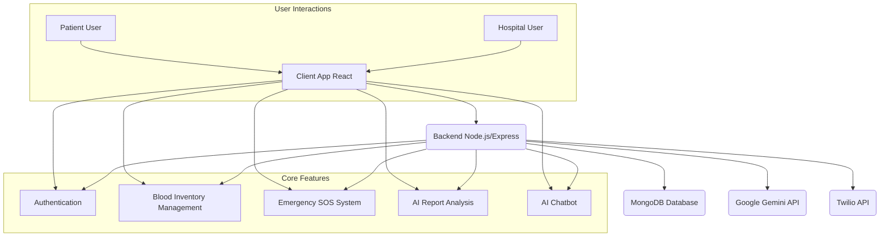

# BloodDoc: AI-Powered Blood Donation & Health Management System

## Overview
BloodDoc is a cutting-edge platform designed to revolutionize blood donation and health management. It connects patients in need with hospitals, streamlines blood inventory management, and leverages AI for intelligent report analysis and chatbot assistance. This system ensures efficient, transparent, and responsive healthcare support for critical blood requirements.

## Features
*   **Smart Blood Matching:** AI-powered blood type compatibility and real-time inventory tracking for efficient allocation.
*   **Emergency SOS System:** Instant emergency alerts to nearby hospitals for critical blood requirements, utilizing Twilio for SMS notifications.
*   **Hospital Network:** Connect with verified hospitals and medical professionals, enabling seamless blood requests and responses.
*   **Blood Analytics:** Advanced analytics and reporting for better blood management and resource optimization within hospitals.
*   **AI Report Analysis:** Upload health reports for AI-driven analysis, extracting key information, summaries, and recommendations.
*   **AI Chatbot:** An intelligent chatbot provides general health information, guides users, and answers common queries.
*   **Role-Based Dashboards:** Separate dashboards for patients and hospitals, providing tailored functionalities and data visualizations.

## Architecture


## Technologies Used

### Frontend
*   **React:** A JavaScript library for building user interfaces.
*   **TypeScript:** A typed superset of JavaScript that compiles to plain JavaScript.
*   **Vite:** A fast build tool that provides a quicker development experience.
*   **Tailwind CSS:** A utility-first CSS framework for rapidly styling components.
*   **Framer Motion:** A production-ready motion library for React.
*   **React Router DOM:** Declarative routing for React.
*   **Chart.js & React Chartjs 2:** For creating interactive data visualizations.

### Backend
*   **Node.js:** A JavaScript runtime built on Chrome's V8 JavaScript engine.
*   **Express.js:** A fast, unopinionated, minimalist web framework for Node.js.
*   **MongoDB:** A NoSQL database program, using JSON-like documents with optional schemas.
*   **Mongoose (not explicitly in package.json, but commonly used with MongoDB/Node.js apps):** An ODM library for MongoDB and Node.js.
*   **jsonwebtoken:** For implementing JWT-based authentication.
*   **bcryptjs:** For hashing passwords securely.
*   **cors:** Node.js package for providing a Connect/Express middleware that can be used to enable CORS with various options.
*   **Multer:** A middleware for handling `multipart/form-data`, primarily used for uploading files.
*   **PDF-Parse:** A simple PDF parser.
*   **Twilio:** For sending SMS notifications.
*   **Google Generative AI:** For AI functionalities (report analysis, chatbot).

## Setup and Installation

### Prerequisites
*   Node.js (v18 or higher)
*   npm (v9 or higher) or Yarn (v1.22 or higher)
*   MongoDB Atlas account or a local MongoDB instance
*   Twilio account and credentials
*   Google Cloud Project with Gemini API enabled and credentials

### Backend Setup

1.  **Clone the repository:**
    ```bash
    git clone https://github.com/your-username/BloodDoc.git
    cd BloodDoc/backend
    ```
2.  **Install dependencies:**
    ```bash
    npm install
    # or yarn install
    ```
3.  **Create a `.env` file** in the `backend` directory and add your environment variables:
    ```
    PORT=3001
    MONGODB_URI=your_mongodb_connection_string
    JWT_SECRET=your_jwt_secret_key
    GEMINI_API_KEY=your_gemini_api_key
    TWILIO_ACCOUNT_SID=your_twilio_account_sid
    TWILIO_AUTH_TOKEN=your_twilio_auth_token
    TWILIO_MESSAGING_SERVICE_SID=your_twilio_messaging_service_sid
    TWILIO_PHONE_NUMBER_PREFIX=+91 # or your country code
    ```
    *   Replace `your_mongodb_connection_string` with your MongoDB Atlas connection string.
    *   Generate a strong `your_jwt_secret_key` (e.g., using `node -e "console.log(require('crypto').randomBytes(32).toString('hex'))"`).
    *   Obtain `your_gemini_api_key` from your Google Cloud Project.
    *   Obtain `your_twilio_account_sid`, `your_twilio_auth_token`, and `your_twilio_messaging_service_sid` from your Twilio account.
    *   Set `TWILIO_PHONE_NUMBER_PREFIX` to the appropriate country code for hospital phone numbers.
4.  **Start the backend server:**
    ```bash
    npm run dev
    # or yarn dev
    ```

### Frontend Setup

1.  **Navigate to the frontend directory:**
    ```bash
    cd ../ # If you are still in the backend directory
    # Then navigate to the frontend if it's in a separate folder, otherwise continue in the root
    # For this project, assume it's in the root
    ```
2.  **Install dependencies:**
    ```bash
    npm install
    # or yarn install
    ```
3.  **Start the frontend development server:**
    ```bash
    npm run dev
    # or yarn dev
    ```

## Usage

### Patient Users
*   **Sign Up/Log In:** Create an account or log in as a patient.
*   **Search Hospitals:** Find nearby hospitals and view their blood inventory.
*   **SOS Request:** Send emergency blood requests to hospitals.
*   **Report Analyzer:** Upload health reports for AI analysis and insights.
*   **AI Chat:** Interact with the AI chatbot for general health information.

### Hospital Users
*   **Sign Up/Log In:** Create an account or log in as a hospital.
*   **Manage Inventory:** Update and manage blood inventory levels.
*   **Handle SOS Requests:** Receive and respond to emergency blood requests.
*   **View Dashboards:** Monitor bed occupancy, blood inventory, and SOS requests.
*   **Blood Request Management:** Create and respond to blood requests from other hospitals.
*   **AI Report Analysis:** Utilize AI to analyze patient reports.

## Contributing
We welcome contributions! Please feel free to fork the repository, create a new branch, and submit a pull request with your enhancements.

## License
This project is licensed under the MIT License. See the `LICENSE` file for details.

## Contact
For any inquiries or support, please contact [your-email@example.com].
